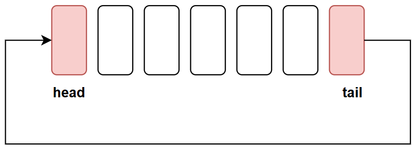
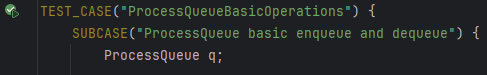
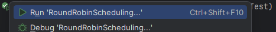
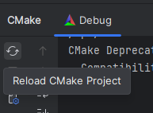

[](https://classroom.github.com/a/EsWQjbWN)
# Homework 2: Simulating Round Robin Scheduling using a Circular Queue

**Course:** Data Structures and Algorithms  
**Due Date:** *November 17th, 2025 by 23:59*  

## Background: Round Robin Scheduling
**Round Robin (RR)** is one of the most widely used CPU scheduling algorithms in operating systems, especially for _time-shared systems_. In this scheduling method, each process is assigned a _fixed time slot_ (also called a **time quantum**). The CPU executes each process for _at most one_ time quantum. If a process does not finish within its time quantum, it is **preempted** (interrupted) and placed at the back of the queue. This cycle continues until all processes are completed.

### How Round Robin Works:
1. All processes are stored in a **ready queue**.
2. The CPU picks the first process in the queue and allows it to run for a **fixed time quantum**.
3. If the process:
   - **Finishes before or when** the time quantum ends, it is **removed** from the queue.
   - **Does not finish**, its remaining execution time is stored, and it is placed back at the end of the queue.
4. The CPU continues this loop until the queue is empty.

### RR Example
Assume a **time quantum = 4 units**, and the following list of processes (each with a unique ID and burst time - duration):

| Process ID | Burst Time (Duration) |
|------------|-----------------------|
| P1         | 10                    |
| P2         | 4                     |
| P3         | 6                     |

**Execution order**:

- P1 runs for 4 units → remaining = 6 → reinsert into queue
- P2 runs for 4 units → completes
- P3 runs for 4 units → remaining = 2 → reinsert
- P1 runs for 4 units → remaining = 2 → reinsert
- P3 runs for 2 units → completes
- P1 runs for 2 units → completes

## Implementation Description
Here are some of the main considerations regarding the homework.

### 1. **Node Structure**
- Each node should store a `Process` data member and a `next` pointer (pointing to the next process in the queue).
- The `Node` struct has already been implemented for you.

### 2. The `Process` struct
- Implement the missing functionality in the `Process` struct
  - A `Process` should contain and `id` (process name, string), `burst_time` (duration of the process, integer) and `remaining_time` (how much time is left in the process, integer)
  - Add a _default_ constructor, and a constructor that takes in all `Process` parameters

### 2. The `ProcessQueue` Class

The `ProcessQueue` class will act as the _ready queue_ into which incoming processes should be inserted.

You should implement it as a **circular queue**. A circular queue behaves similarly to a regular queue, with the main difference being that the `tail` node of a circular queue **points back to `head`**, **not** `nullptr`. 



Implement the following methods in the `ProcessQueue` (found in `src/ProcessQueue.cpp`):
- `void enqueue(const Process& data)`: Inserts a new `Process` into the circular queue
- `Process dequeue()`: Removes the head `Process` from the circular queue, and returns it.
- `Process& peek() const`: Returns the head `Process` from the circular queue, but _does not_ remove it.
- `int size() const`: Returns the number of processes in the queue.
- `bool is_empty() const`: Checks whether the queue is empty or not.
- **Copy and Move Semantics:**
    - Implement the **copy constructor** and **copy assignment operator**.
    - Implement the **move constructor** and **move assignment operator**.
- _initializer list_ constructor

### 3. The `RoundRobinScheduler` Class

The `RoundRobinScheduler` class will contain the **main logic** for running the processes in the queue

Implement the following methods in the `RoundRobinScheduler` (found in `src/RoundRobinScheduler.cpp`):
- `RoundRobinScheduler(int quantum)`: the **constructor**; takes in and sets the _time quantum_ value, and initializes an _instance_ of the `ProcessQueue` class (called `processes`)
- `~RoundRobinScheduler()`: the **destructor**; should clean up the class and _destroy_ the `processes` instance
- `void add_process(const std::string& id, int burst_time) const`: Takes in data for a `new Process` (ID and burst time), and adds the process into the queue
- `void set_quantum(int _quantum)`: Updates the value of the time quantum
- `void run()`: Runs the **round-robin algorithm** on the added processes
  - The `run()` method should **print out** an output in this format (the values are from the [round-robin example](#rr-example)):
  ```html
    Process P1 executed for 4 units. Remaining: 6
    Process P2 executed for 4 units. Remaining: 0
    Process P3 executed for 4 units. Remaining: 2
    Process P1 executed for 4 units. Remaining: 2
    Process P3 executed for 2 units. Remaining: 0
    Process P1 executed for 2 units. Remaining: 0
    All processes completed. Total time: 20
    ```
  - Make sure your output format **exactly matches** the one given here; **otherwise**, your tests _will be failing_.
- `int get_total_time() const`: Returns the total time taken to run all processes

### 4. **Helper Functions**
- The functions `Node<Data>* get_head()` and `Node<Data>* get_tail()` are necessary for running tests, so _do not_ remove them.

## Examples For Testing

Here are some example values you can test with, to see if your implementation is working correctly.

You can also use [this CPU scheduling solver](https://process-scheduling-solver.boonsuen.com/) (switch to Round-Robin algorithm, and use all 0s for arrival times).

### Example 1:
#### Processes (time quantum = 4)
| Process ID | Burst Time |
|------------|------------|
| P1         | 10         |
| P2         | 4          |
| P3         | 6          |

#### Expected output:
```html
Process P1 executed for 4 units. Remaining: 6
Process P2 executed for 4 units. Remaining: 0
Process P3 executed for 4 units. Remaining: 2
Process P1 executed for 4 units. Remaining: 2
Process P3 executed for 2 units. Remaining: 0
Process P1 executed for 2 units. Remaining: 0
All processes completed. Total time: 20
```

### Example 2:
#### Processes (time quantum = 3)
| Process ID | Burst Time |
|------------|------------|
| P1         | 5          |
| P2         | 3          |
| P3         | 7          |

#### Expected output:
```html
Process P1 executed for 3 units. Remaining: 2
Process P2 executed for 3 units. Remaining: 0
Process P3 executed for 3 units. Remaining: 4
Process P1 executed for 2 units. Remaining: 0
Process P3 executed for 3 units. Remaining: 1
Process P3 executed for 1 units. Remaining: 0
All processes completed. Total time: 15
```

### Example 3:
#### Processes (time quantum = 4)
| Process ID | Burst Time |
|------------|------------|
| P1         | 12         |
| P2         | 5          |
| P3         | 8          |
| P4         | 3          |

#### Expected output:
```html
Process P1 executed for 4 units. Remaining: 8
Process P2 executed for 4 units. Remaining: 1
Process P3 executed for 4 units. Remaining: 4
Process P4 executed for 3 units. Remaining: 0
Process P1 executed for 4 units. Remaining: 4
Process P2 executed for 1 units. Remaining: 0
Process P3 executed for 4 units. Remaining: 0
Process P1 executed for 4 units. Remaining: 0
All processes completed. Total time: 28
```

### Example 4:
#### Processes (time quantum = 3)
| Process ID | Burst Time |
|------------|------------|
| P1         | 10         |
| P2         | 6          |
| P3         | 4          |
| P4         | 8          |

#### Expected output:
```html
Process P1 executed for 3 units. Remaining: 7
Process P2 executed for 3 units. Remaining: 3
Process P3 executed for 3 units. Remaining: 1
Process P4 executed for 3 units. Remaining: 5
Process P1 executed for 3 units. Remaining: 4
Process P2 executed for 3 units. Remaining: 0
Process P3 executed for 1 units. Remaining: 0
Process P4 executed for 3 units. Remaining: 2
Process P1 executed for 3 units. Remaining: 1
Process P4 executed for 2 units. Remaining: 0
Process P1 executed for 1 units. Remaining: 0
All processes completed. Total time: 28
```

### Example 5:
#### Processes (time quantum = 5)
| Process ID | Burst Time |
|------------|------------|
| P1         | 9          |
| P2         | 7          |
| P3         | 11         |
| P4         | 4          |

#### Expected output:
```html
Process P1 executed for 5 units. Remaining: 4
Process P2 executed for 5 units. Remaining: 2
Process P3 executed for 5 units. Remaining: 6
Process P4 executed for 4 units. Remaining: 0
Process P1 executed for 4 units. Remaining: 0
Process P2 executed for 2 units. Remaining: 0
Process P3 executed for 5 units. Remaining: 1
Process P3 executed for 1 units. Remaining: 0
All processes completed. Total time: 31
```

### Example 6:
#### Processes (time quantum = 4)
| Process ID | Burst Time |
|------------|------------|
| P1         | 13         |
| P2         | 7          |
| P3         | 9          |
| P4         | 6          |

#### Expected output:
```html
Process P1 executed for 4 units. Remaining: 9
Process P2 executed for 4 units. Remaining: 3
Process P3 executed for 4 units. Remaining: 5
Process P4 executed for 4 units. Remaining: 2
Process P1 executed for 4 units. Remaining: 5
Process P2 executed for 3 units. Remaining: 0
Process P3 executed for 4 units. Remaining: 1
Process P4 executed for 2 units. Remaining: 0
Process P1 executed for 4 units. Remaining: 1
Process P3 executed for 1 units. Remaining: 0
Process P1 executed for 1 units. Remaining: 0
All processes completed. Total time: 35
```

### Example 7:
#### Processes (time quantum = 6)
| Process ID | Burst Time |
|------------|------------|
| P1         | 18         |
| P2         | 7          |
| P3         | 12         |
| P4         | 5          |

#### Expected output:
```html
Process P1 executed for 6 units. Remaining: 12
Process P2 executed for 6 units. Remaining: 1
Process P3 executed for 6 units. Remaining: 6
Process P4 executed for 5 units. Remaining: 0
Process P1 executed for 6 units. Remaining: 6
Process P2 executed for 1 units. Remaining: 0
Process P3 executed for 6 units. Remaining: 0
Process P1 executed for 6 units. Remaining: 0
All processes completed. Total time: 42
```

### Example 8:
#### Processes (time quantum = 2)
| Process ID | Burst Time |
|------------|------------|
| P1         | 10         |
| P2         | 5          |
| P3         | 8          |
| P4         | 3          |

#### Expected output:
```html
Process P1 executed for 2 units. Remaining: 8
Process P2 executed for 2 units. Remaining: 3
Process P3 executed for 2 units. Remaining: 6
Process P4 executed for 2 units. Remaining: 1
Process P1 executed for 2 units. Remaining: 6
Process P2 executed for 2 units. Remaining: 1
Process P3 executed for 2 units. Remaining: 4
Process P4 executed for 1 units. Remaining: 0
Process P1 executed for 2 units. Remaining: 4
Process P2 executed for 1 units. Remaining: 0
Process P3 executed for 2 units. Remaining: 2
Process P1 executed for 2 units. Remaining: 2
Process P3 executed for 2 units. Remaining: 0
Process P1 executed for 2 units. Remaining: 0
All processes completed. Total time: 26
```

### Example 9:
#### Processes (time quantum = 7)
| Process ID | Burst Time |
|------------|------------|
| P1         | 6          |
| P2         | 11         |
| P3         | 9          |
| P4         | 21         |
| P5         | 38         |
| P6         | 17         |
| P7         | 29         |

#### Expected output:
```html
Process P1 executed for 6 units. Remaining: 0
Process P2 executed for 7 units. Remaining: 4
Process P3 executed for 7 units. Remaining: 2
Process P4 executed for 7 units. Remaining: 14
Process P5 executed for 7 units. Remaining: 31
Process P6 executed for 7 units. Remaining: 10
Process P7 executed for 7 units. Remaining: 22
Process P2 executed for 4 units. Remaining: 0
Process P3 executed for 2 units. Remaining: 0
Process P4 executed for 7 units. Remaining: 7
Process P5 executed for 7 units. Remaining: 24
Process P6 executed for 7 units. Remaining: 3
Process P7 executed for 7 units. Remaining: 15
Process P4 executed for 7 units. Remaining: 0
Process P5 executed for 7 units. Remaining: 17
Process P6 executed for 3 units. Remaining: 0
Process P7 executed for 7 units. Remaining: 8
Process P5 executed for 7 units. Remaining: 10
Process P7 executed for 7 units. Remaining: 1
Process P5 executed for 7 units. Remaining: 3
Process P7 executed for 1 units. Remaining: 0
Process P5 executed for 3 units. Remaining: 0
All processes completed. Total time: 131
```

## Implementation Constraints
- Do **not** use `std::queue` or any standard library queue implementations - you have to code your own.
- The classes must support **dynamic memory management** (allocation and deallocation).
- Implement **exception handling** for cases like trying to remove data from empty queues.

## Running the Tests
To verify the correctness of your implementation, you can run the **unit tests** that come with this repository.

You have two ways to run tests.

1. You can run each test _individually_ by clicking on the "Run" button next to the `TEST_CASE` keywords in the `test/tests.cpp` file.

    
    

    There are 10 tests in total, so running each one individually might become tedious, but it is a good way to test out each individual piece of functionality.
2. You can run _all tests at once_ by clicking on the "Run" button next to the `add_test` command in the `CMakeLists.txt` file.

   
   

### Q/A: I cannot see the "Run" icon.
If you cannot see the "Run" icon (green play button) for whatever reason next to your tests, the most likely explanation is that your project is _not properly built_.

To re-build your project, click on the `CMake` icon (a triangle with another triangle in it) in the _bottom-left sidebar_ of CLion, followed by `Reload CMake Project`.

 


After the project is reloaded, you should be able to run your tests (you might need to close and re-open the test file).

If you still cannot run the tests, contact the course professor.

---
https://ibu.edu.ba 
