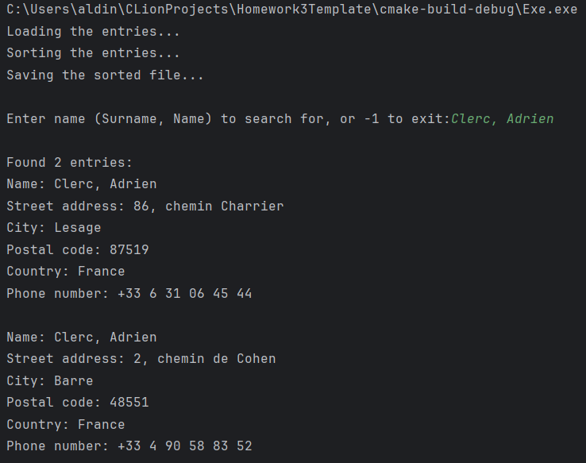
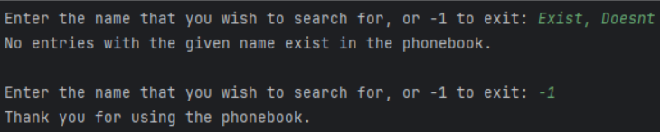
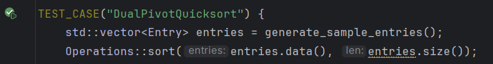
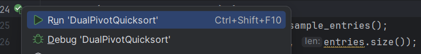
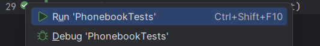

[](https://classroom.github.com/a/Z26k4-Xx)
# Homework 3: Building a phonebook system
**Course**: Data Structures and Algorithms

**Due Date**: _December 1st, 2025 by 23:59_

## The scenario

You are a new, but prospective, young developer working for the IT department of WorldConnect™, a large worldwide phone and telecommunications institution, with representative offices all over the world.

Despite offering good telecommunications services, the company's internal IT systems are still (a lot) a bit outdated, with every branch office keeping track of their respective customers in a different way. As one of their projects and efforts to centralize data management, WorldConnect™ decided to create a _global phonebook_ system consisting of all their active users, and turn it into an **easily searchable database** of all users across every supported country. Each country office exported their own customers into a CSV-formatted file and sent them to the central server to be merged into a single file.

The data was supposed to be properly sorted and merged. However, due to certain technical issues on the server, [the resulting CSV dataset](https://drive.google.com/file/d/1Rqk3sXKx79EM9S_K1tKDkZJYAjHqofud/view) mixed up all the user rows, creating a randomized file of _1,000,000 (1 million) users_. The dataset is a **semicolon-separated (;)** file with the following properties recorded for each user (in this order):

- user's surname and name (in the format "Surname, Name")
- street address
- city
- postcode
- country
- phone number

The CSV file ([available here](https://drive.google.com/file/d/1Rqk3sXKx79EM9S_K1tKDkZJYAjHqofud/view)) contains records for 1,000,000 (one million) active customers. Moreover, you note that the **first row** of the CSV file is the column names. Some example data looks like this (notice the ; separators between values):

```
Deschamps, René;rue Suzanne Leroux;Perretdan;06346;France;+33 2 90 37 88 59
Mckee, Thomas;296 Sanders Roads Apt. 856;Hernandezburgh;18218;United States;958.718.0301
Williams, Samuel;4986 Adam Path Apt. 370;Livingstonside;31544;United States;335-608-6185x14031
Jasprica, Biserka;Vončinina 5a;Split;40769;Croatia;031 423 548
Camanni, Galasso;Strada Sgarbi, 5;Massa E Cozzile;28019;Italy;0565913896
Brown, George;Flat 1 Moore locks;South Danielmouth;E43 7SB;United Kingdom;+443069990278
Hövel, Janet;Kühnertplatz 76;Fallingbostel;04542;Germany;08945 734027
Dixon, Laura;013 Craig Throughway;Johnsonberg;46109;United States;834-480-5285
Hering, Luisa;Langering 8/8;Gräfenhainichen;26553;Germany;05971 44694
…
```

**This is where you step in.**

## Task 1: Create a search system using a sorted dataset + binary search

It is now up to you to take this large CSV file and make it into a _searchable system_. Brushing up on your Data Structures and Algorithms knowledge, the first idea that comes to mind is **binary search**. But, to apply binary search, you need to first have a _sorted collection_ of data.

So, you get to work.

### Part 1: Implement the utils & sort logic

After examining the sorting algorithm performance, you decide on **quick sort** with **dual-pivot partitioning**. To be able to sort the file, you need to do a few prerequisite steps.

For one, you need to create an **Entry** struct (in `include/Entry.h`) that will hold the relevant information for each user record. The Entry class should contain the user's surname and name, street address, city, postcode, country and phone number. Moreover, the Entry struct should _overload all comparison operators_, so you can use it in a sorting algorithm later.

Next up, you need a way to work with the input file, as well as a way to save the sorted result. In the **FileUtils** class (in `src/FileUtils.cpp`) you will need to implement:

- `Entry* read_file(const std::string& file_path, int len)` → given a file path and the total number of lines, _read all lines_ from the file and return _an array_ containing the **Entry objects**.
- `void write_to_file(const Entry* entries, const std::string& file_path, int len)` → given an array of _Entry objects_, a _file path_ and the length of the array, create **a new CSV file** containing the given data.

Afterwards, you need the _sorting algorithm_ itself. The customer records need to be sorted according to the customer name (that is, "Surname, Name" field). In the `src/Operations.cpp` file, implement:

- `void sort(Entry* entries, int len)` → this method is supposed to receive an _array of Entry objects_, and sort it using the **quick sort** algorithm with **dual-pivot partitioning**
    - The "name" property should be used as the basis of sorting.
- **any additional methods** which are required for quick sort to work (up to you).

### Part 2: Implement the search logic

With the sort logic (and helper methods) in place, you can now move onto the **searching**, which is done in `src/Operations.cpp`. The search needs to be done using the customer's **name** property.

**However**, once sorted, you will notice that the phone book contains a lot of examples of **duplicated names**. For example, there are _four (4) entries for "Clerc, Agnès"_ - which makes sense, as for a company dataset of this size it is not unusual that there are many customers with the same name.

The "standard" binary search will only be able to find a _single entry's index_. You will need to modify the search() method slightly so it returns an **array of indexes** containing the **start** and **end index** of the matched names (e.g. _[163256, 163259]_).

In the `src/Operations.cpp`, implement:

- `int* search(Entry* entries, int len, std::string searchable_name)` → given an array of Entries and the length of the array, this method should return _an integer array_ containing **2 indexes: the start and end index** of the matched entries in the array _if they exist_, or a `nullptr` if they _do not exist_.
    - The "name" property should be used as the basis of search.

To summarize:

- The user will search for a name in the format "Surname, Name".
    - You _do not need_ to support _partial_ matches - it is enough to support the **exact** name match.
- If 1 or more exact matches are found for the name, the method should return an array **[startIndex, endIndex]**, where "start" is the index of the first matching entry, and "end" is the index of the last matching entry.
    - If there is only a single (1) match, the start index == end index.
- If there are no matches, the method should return a **`nullptr`**.

### Part 3: Putting it all together

With all the required classes in place, you can get to work. Implement the search system inside the **main()** method of **src/main.cpp** file.

It is left up to you how to design the "UI / UX" of the system. You are also free to add any additional helper methods if you need them. The main logic of the system should be as follows:

- When the application is started:
    - The _unsorted_ file is loaded into an array
    - It is then _sorted_ using quick sort.
    - The _sorted array_ is saved into a _new CSV file_ of the _same format_ as the original (same order of columns, semicolons as separators).
- The user is then asked to type in a "_Surname, Name_" combination they want to find, _or_ -1 if they want to close the program.
- If the user types in a name, the application will _run binary search_ on the sorted data array.
    - If the entry is **found**, the application needs to _print out how many entries were found_, as well as available details about _each entry_ in a _nicely formatted way_
    - If the entry is _not found_, the application should print out an error message
- When a search is done, the user is prompted to enter a name again. If they enter it, the search process should repeat. If they enter -1, the application should terminate.

Here is an example of how the interaction could look like:



## Testing the Application
You can use some of the below **expected values** from the file for testing:

- Clerc, Adrien → 2 entries
- Sladonja, Mira → 3 entries
- Dominguez, Lauren → 1 entry
- Singleton, Matthew → 3 entries
- Drub, Ismet → 1 entry
- Smith, John → 101 entries

To verify the correctness of your implementation, you can run the **unit tests** that come with this repository.

You have two ways to run tests.

1. You can run each test _individually_ by clicking on the "Run" button next to the `TEST_CASE` keywords in the `test/tests.cpp` file.




   There are 5 tests in total, so running each one individually might become tedious, but it is a good way to test out each individual piece of functionality.
2. You can run _all tests at once_ by clicking on the "Run" button next to the `add_test` command in the `CMakeLists.txt` file.




### Q/A: I cannot see the "Run" icon.
If you cannot see the "Run" icon (green play button) for whatever reason next to your tests, the most likely explanation is that your project is _not properly built_.

To re-build your project, click on the `CMake` icon (a triangle with another triangle in it) in the _bottom-left sidebar_ of CLion, followed by `Reload CMake Project`.


After the project is reloaded, you should be able to run your tests (you might need to close and re-open the test file).

If you still cannot run the tests, contact the course professor.

## Implementation Constraints

**You must not:**
- remove any of the methods in the existing files, rename them or change their signatures.

**You should:**
- implement the missing method bodies for the required functionalities, and make sure they return proper output (if any)
- implement any additional helper methods / variables / classes, if you need them for the solution.

**NOTE:** You **do not need to upload** the original and sorted files with your homework; **just upload the homework code**.

---

https://ibu.edu.ba 
