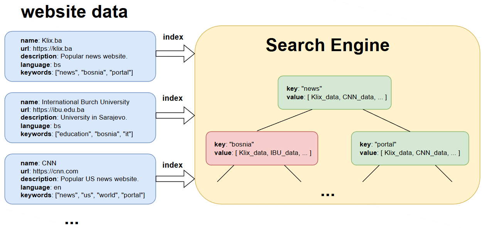
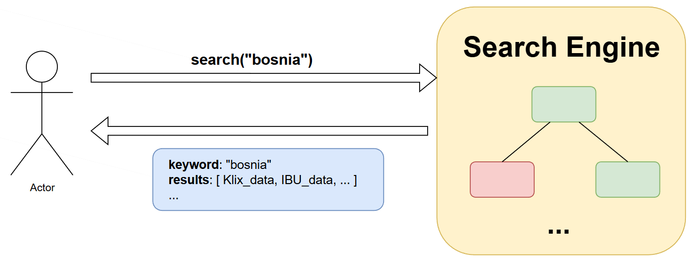
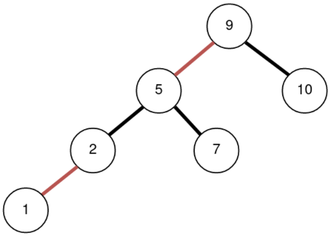
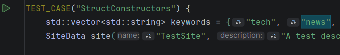
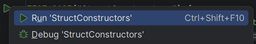
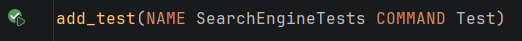
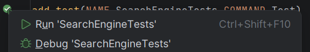
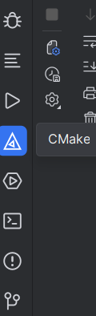

[](https://classroom.github.com/a/saQYU18Q)
# Homework 5: Implementing a simple search engine
**Course**: Data Structures and Algorithms

**Due Date**: _January 4th, 2025 by 23:59_

## The scenario
Your task in this homework is to implement a simple **search engine** for indexing and lookup of _websites_, powered by **left-leaning red-black trees**.

This is how the "main flow" of the search engine is designed:
- Website data (website name, URL, description, language and **website keywords**) are submitted to the search engine.
- The search engine **indexes** (_stores_) the website data based on the **keywords**. 
- The engine uses a **left-leaning red-black tree** as a storage mechanism.
  - For _each keyword_, the engine **adds a new entry** to the tree, with the `keyword` being the _node key_, and the entirety of website data being the _node value_.
  - In other words, if a website has 3 keywords, e.g. ["news", "technology", "business"], the engine creates **3 separate entries in the tree** (`key` --> `value`):
    - `news` --> `website data`
    - `technology` --> `wesbite data`
    - `business` --> `website data`
- The engine also **aggregates** all website data with the _same keywords_ as such:
  - If different websites all contain the _same keyword_, the engine adds **all those websites to the same entry**:
    - E.g. if 3 websites have a _common keyword_, e.g. "technology", the engine will add _all 3 websites to the same node_:
    - `technology` --> `[ website1_data, website2_data, website3_data ]`
- When users **search** for websites, they will enter the **keyword**, and the search engine returns a _list of all websites_ (along with all their data) with that keyword.

Below are two illustrations showcasing the **index** and **user search** operations.

### Indexing


In the example above, you can see that both Klix and CNN contain the "news" keyword, so the engine placed them into the `value` property of the _same tree node_. Moreover, you can also notice that website data for Klix has been recorded into the tree **3 times** - _once for each keyword_ ("news", "bosnia", "portal")

### Searching


Searching works based on _keywords_ - if the keyword is recorded in search engine, it will return _all website data_ that the keyword points to.

## Implementation Steps

### Part 1: Implement the required structs

The search engine will make use of **four (4) different structs**.

#### SiteData
First, you need to create a `SiteData` struct (`include/SiteData.h`), that will hold relevant information for the website. The SiteData struct should contain the _website's name_, _URL_, _description_, _language_ and a **vector** of _keywords_ describing that website. 

Moreover, the struct should also implement a **constructor** that can set all of its properties.

#### SearchNode
Next, you will create a `SearchNode` struct (`include/SearchNode.h`). SearchNode represents how the **search engine** will store the website data. This struct should look like a typical _red-black tree node_, with the **key** being the _keyword_, and the **value** being a **vector** of _website data_ from _all websites that use that keyword_. 

Moreover, the struct should also keep track of node color, and left / right child pointers. Additionally, there should be a **constructor** that can set the key, value and color properties.

#### SearchResult
You will also need to implement structs `SearchResult` (`include/SearchResult.h`) and `Debug` (`include/Debug.h`). SearchResult repents **the value** that will be _returned to the user_ when they _search_ for a keyword using the search engine. This struct contains the _keyword_ that user searched for, a _results_ **vector** of matching website data, as well as two more properties: "debug mode" and "debug data". These two properties will be explained more thoroughly later, but "debug mode" should be a boolean value representing whether the search engine was in "debug mode" when returning the result, and "debug data" should be a `Debug` instance. 

SearchResult should support **two constructors:**, one to initialize all its properties to given values, and a **default constructor** that will set the keyword to an _empty string_, results to an _empty vector_, "debug mode" to _false_, and "debug data" to its _default value_.  

#### Debug
Finally, the `Debug` struct contains two properties, the number of _black edges_ and _red edges_ encountered during the search for a keyword, as well as a **constructor** to set these values. The next section in the document explains how and where the Debug struct is used.

Debug should support **two constructors:** one to initialize the number of red and black edges to given values, and a **default constructor** that will set red and black edge count to **-1**.

### Part 2: Implement the search engine

After implementing all structs, it is now time to implement the actual **search engine logic**. You need to complete the following methods (in `src/SearchEngine.cpp`):

- `void index(const SiteData& data)` → takes in a website data instance (`SiteData` reference), and _adds it to the search engine_.
  - As explained earlier, this method should go through **all keywords** in the website data, and - _for each keyword_ - add **a new entry** to the tree.
  - The _keyword_ should be the _node key_.
  - The _website data_ should be added to the _node value_ (which is a **vector**).
    - If the keyword appears for the _first time_, a _new node_ should be created and the website data added to it.
    - If the keyword appears _again_, the website data should _just_ be added to an _existing node_ corresponding to that keyword.
  - Make sure you properly apply **color balancing** operations (rotations and color flip) during insertion. 

- `void toggle_debug_mode()` → toggles the SearchEngine's `debug_mode` property.
  - `debug_mode` is a boolean property on the SearchEngine class that denotes if the search engine is in "debug mode" or not.
  - Calling this method should **toggle** the debug mode state (true → false, or false → true, depending on the value).

- `SearchResult search(const std::string& keyword) const` → takes in a **keyword** to search for, and returns a search result (`SearchResult` instance).
  - If the search is **successful**:
    - The search result (implemented in Part 1) contains the searched keyword, _vector of site data_ (websites that contain that keyword), as well as "debug mode" and "debug data".
    - Debug mode should equal the _current value_ of the engine's `debug_mode` property.
    - If "debug mode" is set to `true`, the "debug data" (`Debug` instance) should contain the **number of red and black edges** that were found **on the path** towards the node.
    - If "debug mode" is set to `false`, the "debug data" (`Debug` instance) should set **both the red and black edge count** to **-1**.
  - If the search is **unsuccessful** (the searched keyword _does not exist_):
    - The search result (implemented in Part 1) contains the searched keyword, an _empty vector_, as well as "debug mode" and "debug data".
    - Debug mode should equal the _current value_ of the engine's `debug_mode` property.
    - The "debug data" (`Debug` instance) should set **both the red and black edge count** to **-1**.
  - The search should match **only the full, exact keyword**. You **do not need** to implement partial matching, case sensitivity nor matching by other properties.

#### Additional explanation: How to count red and black edges

Here is an example red-black tree:


- When counting the number of red and black edges **on the way towards a node**:
  - For example, if I am looking for key 1, from the root to key 1 there are:
    - 1 black edge
    - 2 red edges
  - When looking for **key 7**:
    - 1 black edge
    - 1 red edge
  - When looking for **key 10**:
    - 1 black edge
    - 0 red edges
  - etc.

### Part 3: Overloading the SearchResult output operator

In the final task, you need to implement an _overload_ for the **output operator** - `<<` - of the `SearchResult` struct, making it possible to pretty-print a given search result.

Here are some examples (e.g. searching for keywords "education" and "nonexisting").

If a search was **successful**, and "debug mode" is **off**, output should look like this:
```text
Keyword: education
Result count: 2
Sites:
-- Name: BalkanEdu
-- URL: https://balkanedu.com
-- Description: Educational resources and online courses for students.
-- Language: en
-- Keywords: education courses technology learning

-- Name: IT Akademija
-- URL: https://itakademija.ba
-- Description: IT education platform for developers and engineers.
-- Language: bs
-- Keywords: education technology programming courses
```

If a search was **successful**, and "debug mode" is **on**, output should look like this:
```text
Keyword: education
Result count: 2
Sites:
-- Name: BalkanEdu
-- URL: https://balkanedu.com
-- Description: Educational resources and online courses for students.
-- Language: en
-- Keywords: education courses technology learning

-- Name: IT Akademija
-- URL: https://itakademija.ba
-- Description: IT education platform for developers and engineers.
-- Language: bs
-- Keywords: education technology programming courses
 
Debug info:
-- Red links: 0
-- Black links: 1
```

If a search was **unsuccessful**, and "debug mode" is **off**, output should look like this:
```text
Keyword: nonexisting
No results found.
```

If a search was **unsuccessful**, and "debug mode" is **on**, output should look like this:
```text
Keyword: nonexisting
No results found.

Debug info:
-- Red links: -1
-- Black links: -1
```

## Testing the Application

To verify the correctness of your implementation, you can run the **unit tests** that come with this repository.

You have two ways to run tests.

1. You can run each test _individually_ by clicking on the "Run" button next to the `TEST_CASE` keywords in the `test/tests.cpp` file.




There are 10 tests in total, so running each one individually might become tedious, but it is a good way to test out each individual piece of functionality.
2. You can run _all tests at once_ by clicking on the "Run" button next to the `add_test` command in the `CMakeLists.txt` file.




### Q/A: I cannot see the "Run" icon.
If you cannot see the "Run" icon (green play button) for whatever reason next to your tests, the most likely explanation is that your project is _not properly built_.

To re-build your project, click on the `CMake` icon (a triangle with another triangle in it) in the _bottom-left sidebar_ of CLion, followed by `Reload CMake Project`.




After the project is reloaded, you should be able to run your tests (you might need to close and re-open the test file).

If you still cannot run the tests, contact the course professor.

## Implementation Constraints

**You must not:**
- remove any of the methods in the existing files, rename them or change their signatures.

**You should:**
- implement the missing method bodies for the required functionalities, and make sure they return proper output (if any)
- implement any additional helper methods / variables / classes, if you need them for the solution.
---

https://ibu.edu.ba 